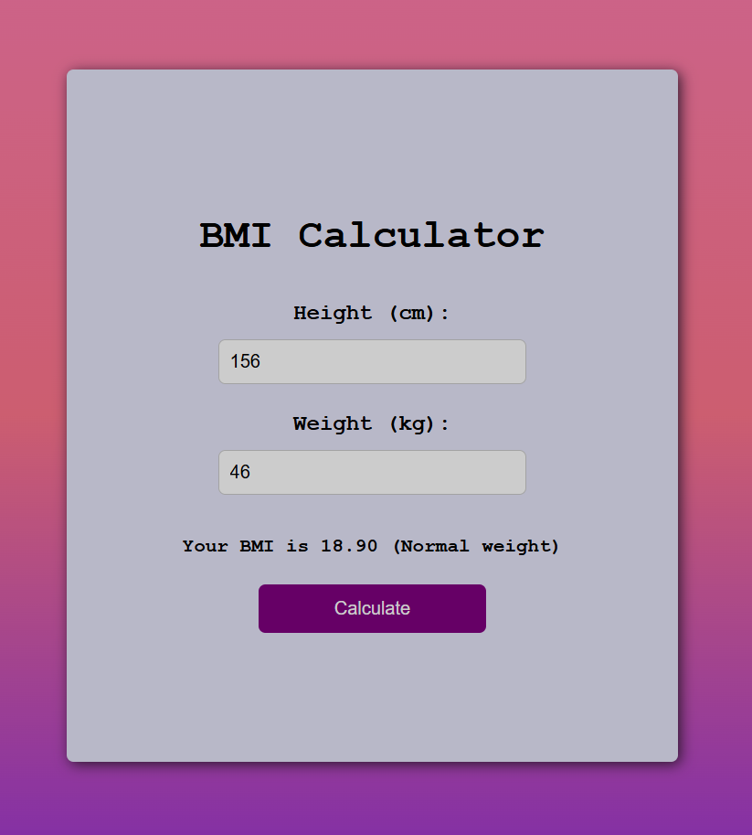

# 💪BMI Calculator

This simple tool helps you to calculate your Body Mass Index (BMI), a measure of body fat based on your weight and height. 

## 🌞How to Use

- Enter your height.
- Enter your weight.
- Click **Calculate**.
- View your BMI result.

## 📊BMI Categories
- **Underweight**: BMI < 18.5
- **Normal weight**: BMI 18.5 - 25
- **Overweight**: BMI 25 - 30
- **Obese**: BMI ≥ 30

## Calculate your BMI now!
Click here: [BMI Calculator](https://megzz24.github.io/BMI-calculator/)

## 📸Screenshot

## ⚙️Tech Stack

  

